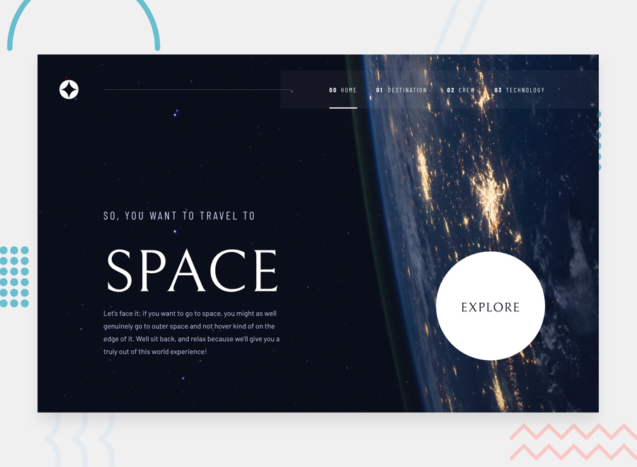

# Frontend Mentor - Space tourism website solution

This is a solution to the [Space tourism website challenge on Frontend Mentor](https://www.frontendmentor.io/challenges/space-tourism-multipage-website-gRWj1URZ3). Frontend Mentor challenges help you improve your coding skills by building realistic projects. 

### About Site

This responsive multipage website is build with:

- [React](https://reactjs.org/) - JS library
- [Swiper](https://swiperjs.com/) - JS library
- TypeScript
- SCSS

### Links

- Live Site URL: [Netlify](https://discover-the-space.netlify.app/)
- Solution URL: [Frontend Mentor](https://discover-the-space.netlify.app/)

